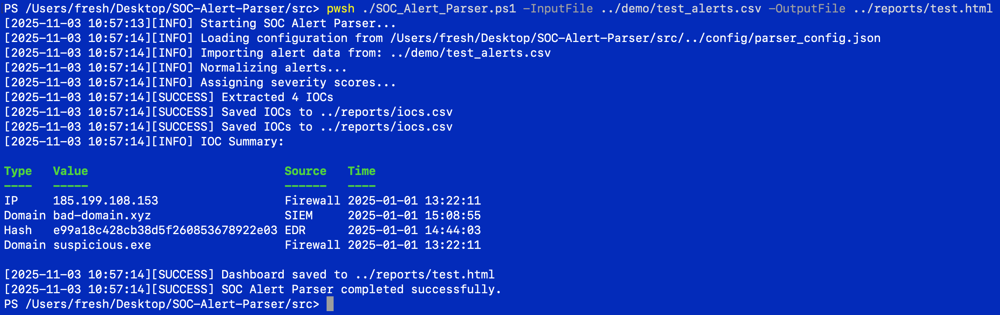
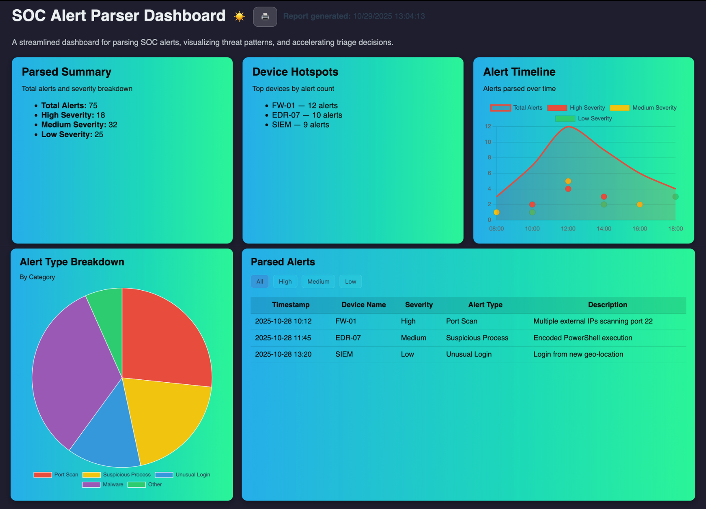

# SOC Alert Parser (Demo)

**SOC Alert Parser** is a lightweight PowerShell utility that helps security analysts quickly parse, normalize, and summarize raw alert data from SIEM platforms such as Microsoft Sentinel, Splunk, or Elastic.

This **demo version** provides a preview of the tool’s functionality using sample data and a simplified parser.  
The **full version**, available at [FreshCMD.com](https://freshcmd.com/products), includes advanced features for real-world SOC and security operations environments.

---
### 🔹 1. Running the Parser in PowerShell


### 🔹 2. Parsed Alert Output (Console View)


### 🔹 3. Generated HTML Report to Dashboard


## Features (Demo Version)
- Parse sample CSV alert data  
- Display structured alert summaries  
- Generate basic HTML report output  
- Clean, commented PowerShell code for easy review  

**Full version adds:**
- Multi-format input support (`.csv`, `.json`, `.log`)  
- Severity scoring and alert categorization  
- Configurable field mapping  
- Enhanced HTML/CSV reporting templates  
- Automatic normalization of alert types  

> [View the full version](https://freshcmd.com/products/)

---

## Repository Structure

<code> 
"SOC-Alert-Parser-Demo/
│
├── demo/
│ ├── sample_alerts.csv # Example alert data
│ ├── demo_output.html # Example HTML report
  ├── template.html # Customized Dashboard that displays sample alert data
│
├── src/
│ └── SOC_Alert_Parser_Demo.ps1 # Limited demo version of the parser
│
├── docs/
│ ├── overview.md # Detailed feature overview
│ ├── install_guide.md # Setup and usage guide
│ └── changelog.md # Version history
│
├── BUY_FULL_VERSION.md # Link and details for full version
├── LICENSE # Demo license terms
└── SECURITY.md # Trust and verification details
<code>

⚠️ Important: Only edit report_template.html to change layout or styling. 
The script will overwrite demo_output.html every time it runs.

---
# Quick Start
## Requirements
- Windows PowerShell 5.1 or PowerShell 7+
- macOS/Linux users must install and run via pwsh
- Script execution permission (Windows only):
  Set-ExecutionPolicy RemoteSigned -Scope CurrentUser
  
## Run the Demo
## Windows
```cd src```
```.\SOC_Alert_Parser_Demo.ps1```
## Mac
```cd src```
```pwsh ./SOC_Alert_Parser_Demo.ps1```

